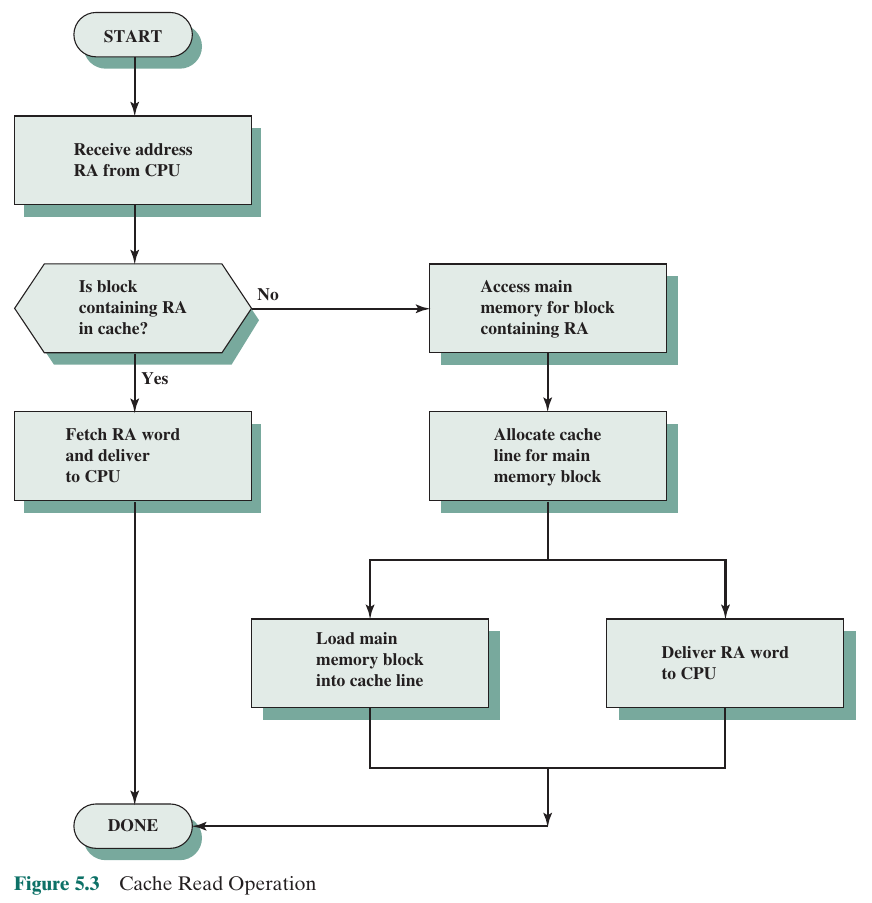

# Cache Memory
## Cache Memory Principles
Cache memory contains blocks of data. Entire blocks are retrieved from memory upon a cache miss. The *spatial and temporal locality* of memory references makes this efficient, since if data from a memory location is required, then the other data in that block will likely be used as well.
- **Block**: The minimum unit of transfer between cache and main memory
- **Line**: A portion of cache memory capable of holding *one* block
- **Tag**: A portion of a cache *line* that is used for addressing purposes

Below is a figure of cache read operation:

