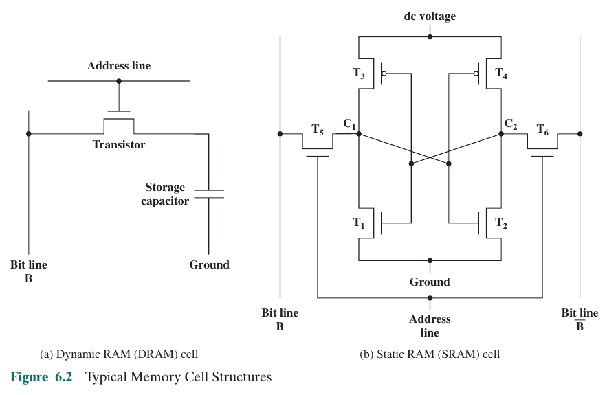

# Internal Memory
## Semiconductor Main Memory
In early computers, random access memory was implemented using and array of doughnut-shaped ferromagnetic loops. However, today the use of semiconductor chips for main memory is almost universal.

### Organisation
The basic element is the **memory cell**, which has the following properties:
- Have two stable states (to represent binary 0 and 1)
- Can be written to (at least once)
- Can be read to sense their state

### DRAM and SRAM
DRAM and SRAM are the two traditional forms of RAM used in computers.

#### Dynamic RAM (DRAM)
These store data as charge on capacitors. The presence or absence of charge is interpreted as a binary 1 or 0. 

Capacitors naturally discharge over time, so DRAM requires a periodic refresh, during which the capacitors that contain 1s are fully recharged.

The word *dynamic* refers to this tendency of the stored charge to leak away, even if power is continuously applied. Furthermore, reading the value also discharges the capacitor. The charge is restored during a complete read operation. 

#### Static RAM (SRAM)
SRAM is constructed using a flip-flop logic gate configuration. Data is held for as long as power is supplied to the circuit. 

#### DRAM vs SRAM
Both types are *volatile* (data stored is lost without a power supply). A DRAM memory cell is simpler and smaller that that of SRAM, therefore we can pack more storage into the same amount of space on a chip using DRAM. DRAM is also cheaper per bit than SRAM. However, DRAM requires refresh circuitry. For these reasons, DRAM is preferred for larger memory requirements. On the other hand, SRAM is faster than DRAM. These relative characteristics have led computer designers to use SRAM for cache memory, and DRAM for main memory in most systems. 

### Read-Only Memory (ROM)
ROM is nonvolatile. While it is possible to read from it, new data cannot be written. ROM is important for **microprogramming**. Other applications include:
- Library subroutines for common functions
- System programs
- Function tables

The data on a ROM is wired in during the fabrication process. However, less expensive **programmable ROM (PROM)** is also used as an alternative. It is also nonvolatile, and can only be written to *once*, but the writing is performed electrically, and can therefore be done after fabrication by a supplier/customer. Pure ROM remains popular for high-volume production runs. 

There is also optically **erasable programmable read-only memory (EPROM)**, which is read/written electrically. EPROM cells must all be set to the same erased state before write, before expposure to ultraviolet radiation. Erasure also uses intense ultraviolet light that is shone through a specially designed window. 

Even better is **electrically erasable programmable read-only memory (EEPROM)**, which is a *read-mostly* memory that can be written two at any time without erasing its contents. However writing takes very long. 

**Flash Memory** is like EEPROM and EPROM, however it is designed to have sections of memory erased in a single action (flashed), and can be erased and programmed faster than the other two. 

## Error Correction
- **Hard failure**: permanent physical defect
- **soft error**: random, nondestructive event that alters memory

to correct soft errors, a calculation is performed to detect an error, and then error correction bits are fed along with the original data to corrector circuitry to get the original data. 

Codes used for this are called **error-correcting codes**. The simplest is the **Hamming code**.
